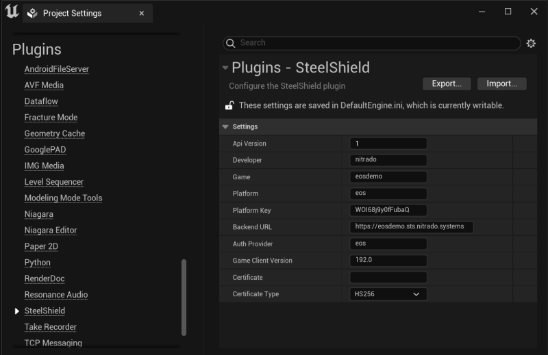
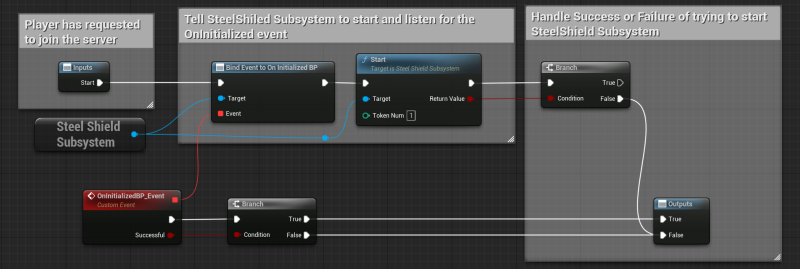
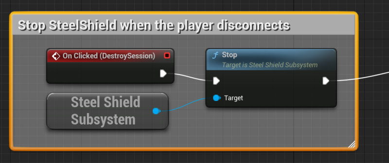

# Using the Plugin

Please ensure you have the SteelShield plugin correctly set up as described in the [Getting Started](/steelshield/unreal-engine-plugin/getting-started) section.

To use the SteelShield Plugin from within your game, you first need to configure the settings unique to your game,
initialize the subsystem and provide it with a token provider which the subsystem can use to get new tokens, and finally
call start on the subsystem to get it to do an initial token request, and subsequent rollover token requests.

## Configuration

Before you begin using the plugin, you need to set up the configuration parameters that is used by the plugin to
communicate with the `SteelShield Token Service`.

These parameters should be provided to you by Nitrado, and can be configured by going to
`Settings→Project Settings→Plugins→SteelShield` in the Unreal Editor.



1. **Api Version** — `SteelShield Token Service` end point API version
2. **Developer** — The name of your company
3. **Game** — The name of the game you are integrating SteelShield with
4. **Platform** — The platform on which this version of the game is for (PC/PS5/XBox etc) or a generic platform in the
   case of a non—platform specific token service
5. **Platform Key** — Unique secret key for this game provided by Nitrado. This is used by the
   `SteelShield Token Service` to authenticate the token requests. Keep this secret!
6. **Backend URL** — Base URL of the `SteelShield Token Service`
7. **Auth Provider** — Provider used to issue the JWT token
8. **Game Client Version** — Current version of the game
9. **Certificate** — Certificate used fro signing the JWT in the case of using the `Default Token Provider` in testing
10. **Certificate Type** — Type of certificate used above. Only used when using `Default Token Provider` in testing

## Initializing the Plugin

This needs to be done via C++ code, and should happen early on in the games startup phase.
A good place to put the initialization is right after the player has been logged into the backend server.

In the below example, the SteelShield subsystem is being initialized right after a successful login to the Epic Online
Services, and is using the EOSTokenService.

```cpp
// NOTE: Error handling has been removed for brevity

IOnlineSubsystem *Subsystem = Online::GetSubsystem(WorldContextObject->GetWorld());
IOnlineIdentityPtr Identity = Subsystem->GetIdentityInterface();

// Set up SteelShield EOS Token Provider
auto *SteelShield = GetGameInstance()->
                    GetEngine()->
                    GetEngineSubsystem<USteelShieldSubsystem>();

const auto TokenProvider = 
    SteelShield->
    SetTokenProvider<UEOSTokenProvider>(UEOSTokenProvider::StaticClass());

TokenProvider->Init(Identity, LocalUserNum);
```

After the initialization has taken place, you should not need to initialize the subsystem again until the game is
restarted or in the case of the EOSTokenProvider, the user logs out of EOS.

## Starting the Plugin

Starting the plugin should take place right before the user attempts to join a server. By starting the plugin, the
subsystem makes a request to the backend `SteelShield Token Service` using the JWT/TokenProvider given during
initialization process.
This then allows the engine component to begin "wrapping" the network packets with a `SteelShield Token`.

::: info Note
The engine components still "wrap" packets with an invalid/uninitialized token if the subsystem is not started.
This causees any network packets to be dropped by the SteelShield firewall network appliance on the path to the game server.
There is no effect on networks or game servers that do not pass though the SteelShield firewall network appliance.
:::

Once the subsystem has been started, it keeps track of the expiry time of tokens, and before tokens expire (usually
15 minutes), it makes another request to the `SteelShield Token Service` to renew its token, and then performs a
token rollover process with the game server.

You need to attach to the OnInitialized (for C++) or OnInitializedBP (for Blueprints) event to know if the SteelShield
subsystem could communicate with the backend token service and start correctly. Only on a successful OnInitialized event
should you continue to join the server.

You need to supply the number of Tokens which the subsystem should request from the Token server.
There should be 1 token per network connection you wish to make to the `Game Server`.
In most normal scenarios this would be 1.

Example of starting the subsystem in Blueprints



Example of starting the subsystem in C++

```cpp
// Player has requested to join the server
const auto SteelShield = GetGameInstance()->
                         GetEngine()->
                         GetEngineSubsystem<USteelShieldSubsystem>();

OnInitializedHandle = 
    SteelShield->
    OnInitialized.AddUObject(this, &ThisClass::OnSteelShieldInitialized);

const bool bSuccess = SteelShield->Start(4);

if (!bSuccess)
{
        UE_LOG(LogTemp, Error, TEXT("Failed to start SteelShield"));
        return;
}
```

```cpp
void ACustomController::OnSteelShieldInitialized(bool bSuccess)
{
    const auto SteelShield = GetGameInstance()->
                             GetEngine()->
                             GetEngineSubsystem<USteelShieldSubsystem>();

    SteelShield->OnInitialized.Remove(OnInitializedHandle);

    if(!bSuccess)
    {
        UE_LOG(LogTemp, Error, TEXT("Failed to start SteelShield"));
        return;
    }

    // The subsystem started without error, continue to connect to server
    ClientTravel(ServerAddress, TRAVEL_Absolute);
}
```

## Stopping the Plugin

When the player disconnects from the server, you should stop the plugin.
This prevents the plugin from continuing to perform rollover checks in the background, and forces it to retrieve new token when the plugin is started again.

Example of stopping the subsystem via Blueprints:



Example of stopping the subsystem via C++:

```cpp
const auto SteelShield = GetGameInstance()->
                         GetEngine()->
                         GetEngineSubsystem<USteelShieldSubsystem>();

SteelShield->Stop();
```

## Enabling Logging

All SteelShield Plugin logs are written to `LogSteelShield`, and other relevant logs written to LogNet. You can enable
this log category and set the default log level to *Verbose* to see what is happening with the plugin by adding the
following section to your *DefaultEngine.ini* file

```ini
[Core.Log]
LogSteelShield=Verbose
LogNet=Verbose
```
